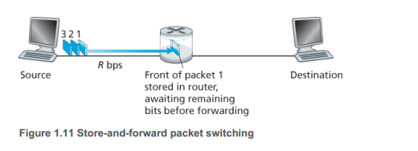

## Chapter 1 Computer Networks and the Internet

### 1.3 The Network Core

**1.3.1 Packet Switching**

There are two predominant types of switching packets:  they are routers and link-layer switches.

**Routing and Forwarding**

What the difference between routing and forwarding?

> Forwarding is the local action of moving arriving packets from router's input to an appropriate router's output link, while routing the global action of determining paths from a source end to a destination end taken by packets.

**Figure 1.11**

*There are 2 links and 1 router in this figure.* 

Regardless of propagation delay, the delay of transmitting L bytes from "Source" to "Destination" is $2L/R$ when the switch uses "Store-and-forward Transmission". Whereas, if the switch transmit the first bit it receives without waiting the whole packet, the delay is $L/R$, because it is literally like the switch doesn't exist. 

##### Forwarding Tables and Routing Protocols

How does a router determine which link it should forward the packet onto?

First of all, there is a IP address in each packet. If a packet is sent to a hamlet B in another province from a village where you live, it is transfer to the nearest router of your home; the router doesn't know how to exactly send the packet to the hamlet, but it knows how to send the province in the IP address. So it sends the packet to a router or link-layer switch in the nearest city and the a switch in the city will send the packet to a switch in a provincial switch. All the switches know the fastest way to a provincial switch. 

Secondly, a switch in the provincial centre reads the IP address and send to another provincial switch. Then it is sent to a switch in a city near the destination, a county and finally the hamlet B. 