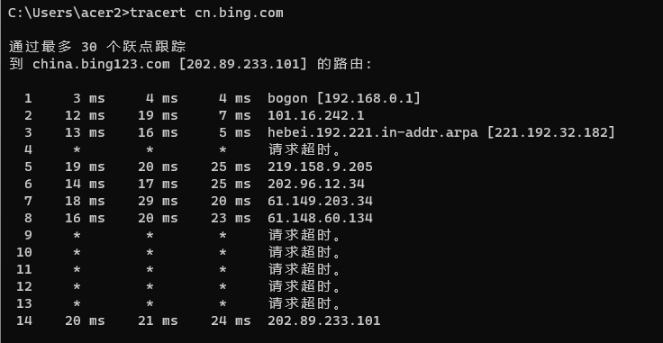

### 1, ARP协议

参考：https://blog.csdn.net/m0_45406092/article/details/118548617
			https://zhuanlan.zhihu.com/p/370507243

ARP协议： (Address Resolution Protocol) 根据IP地址获取物理地址的一种TCP/IP协议

ARP协议流程：

1，假设本地电脑主机IP地址：192.168.0.104，MAC地址：00-D8-61-11-1C-44(MAC地址由6组数字组成每位是一个Byte=两个16进制)，想要找网关192.168.0.1的MAC地址，本主机会以Broadcast广播的形式发送消息。消息中包含本机的IP地址和MAC地址，以及请求的IP地址和用00-00-00-00-00-00表示的MAC地址。

2，如果192.168.0.1收到广播，则会存储主机的IP和MAC地址，然后把自己的MAC地址发送给请求主机。

Wireshark搜索框里输入arp进行过滤后，可用ping  www.baidu.com 来查看本地主机和网关使用ARP交互的过程。

### 2, HTTP协议

HTTP协议也成为无状态协议。

什么是无状态协议？

同一台客户端第一连接断开之后，第二次连接后，服务器无法识别是来自同一个客户的连接，此成为无状态协议。因此引入了Cookie来储存用户状态，跟踪用户浏览记录，保存登录状态等。Cookie由服务端生成，保存在用户浏览器本地中。

参考：https://zhuanlan.zhihu.com/p/131256002

#### 3, traceroute 命令

traceroute(Linux)/tracert(Windows) : 跟踪分组到达目标地址所走过的路由路径，预设发送包是40Kb，可自定义

参考：https://www.cnblogs.com/machangwei-8/p/10353279.html#_label4_1

有三组数据，是因为每次发三个测试包。

