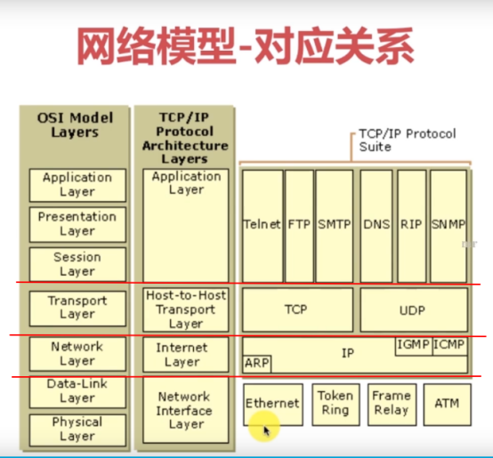

### 1， 网络模型



### 2，Socket原理

Socket实际就是对TCP UDP的一个封装


### 3，TCP和UDP的区别

- TCP有三次握手，TCP只有发送成功与失败两种情况，例，一端发送信息到另一端，另一端收到后会回馈一条信息表明已收到，没收到则不反馈；
- UDP类似与广播，一端发送过去，对面的有没有收到，也不会接收反馈；

### 4，报文相关


 


### 5，传输协议，Mac地址

- 传输协议的含义


- Mac地址是设备硬件的的是个标识，是一个物理地址，网络的ip地址就是根据不同的Mac地址来分配不同的ip地址

### 6，端口的含义


### 1, ip地址的含义

ip地址是计算机的在网络中的唯一标识

例 ： IPV4   192.168.0.1  : 用4个字节(32位)表示， 每个数字范围是0-255

```tex
IPV4由4组8位二进制数组成
0-255 : 2的8次方， 256个
比如：1.1.1.1 转换为二进制
就是 00000001.00000001.00000001.00000001 : 每个点2的8次方
二进制是满二进一，所以每一位只有两个数0和1，那么32位二进制一共有2的32次方个不同的组合。
所以理论上IPV4一共有2的32次方个IP地址
，也就是2^32=4 294 967 296个。
```

ipv6是128位， 即2的128次方个ip地址


### 2 ，域名

为了好记住主机或服务器的名字，常把ip地址映射成域名，易于阅读。

### 3，端口号

实际相当于代表一个ip地址代表的主机中的一个应用程序，相当于一个接口或窗户一样。

端口号范围：0-65535

### 4，TCP/IP协议分层

数据进入协议栈时的封装过程，即要传送的数据需要经过一些封装，以便指导发到哪里，接收数据的电脑要把这些封装的“App首部TCP首部”等去掉，然后获取数据到应用程序里


TCP/IP的分层


### 5， 三次握手简单示意图

- 第一次握手


- 第二次握手


- 第三次握手


### 6，TCP和UDP的区别

一，TCP ：协议是通过三次握手建立，发送方明确知道是哪个地址接收的数据。

二，UDP：发送数据没有指定接收方，类似与广播的意思，就是把数据扔出去，不管对方是否接收到。UDP没有明确的客户端，服务器端，而是数据的接收端和发送端，而且这两个端的角色可以互换。

在Socket网络编程中，UDP两端都是通过DatagramPacket.java来传输数据。


### 7,  Socket的概念

一，Socket实际相当于两个端口，发送数据的是客户端，接收数据的是服务器，网络编程实际就是把网线当作IO流中的管道进行数据传输。

二，网络通信实际上就是Socket间的通信

三，Socket编程有两种：

​	(1)TCP : 比较可靠

​	(2)UDP : 不太可靠

四，客户端和服务器端各有一个Socket


### 8 ,TCP 网络通信编程


### 9，Socket网络编程监听注意点

监听时默认只监听一次，即Socket的客户端发送消息只能发送一次，再发送的话就得再启动Socket相关服务。

### 10, netstat命令, dos窗口命令，不是Linux

netstat  -an  : 查看所有端口

netstat -an | more : 分页显示

netstat -anb : 查看是哪个程序占用了端口


### 11, 客户端也有一个端口和服务器通信

不止服务器有端口，客户端有一个随机的端口来和服务器进行通信；

客户端的端口由TCP/IP来分配的不是个人定义的。

Socket的TCP网络编程在开发中应用较多，UDP使用较少

(2)在Socket网络编程中，UDP两端都是通过DatagramPacket.java来传输数据，

 即在发送端把数据封装到DatagramPacket类型的对象里，在接收端再把接收到的DatagramPacket放到一个空的packet(也是DatagramPacket类对象)里

(3)UDP每个数据包的限制再64kb，不适合传送大数据；

(4)UDP使用Socket传送数据时， 接收端规定好端口，发送端也要规定好端口。原因见本笔记第11条

