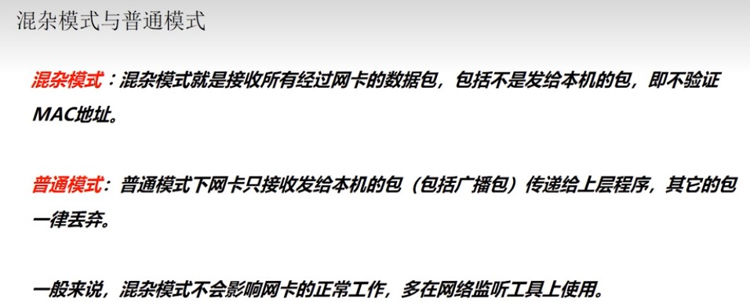
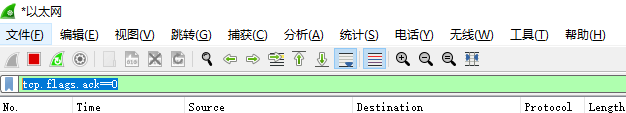
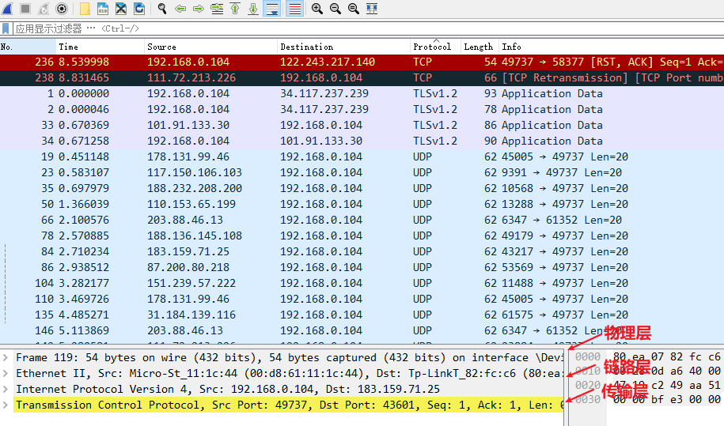
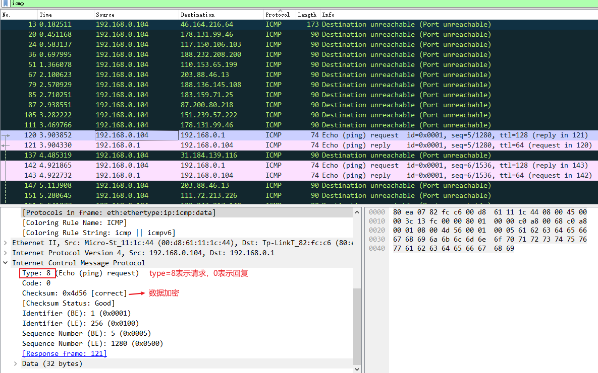
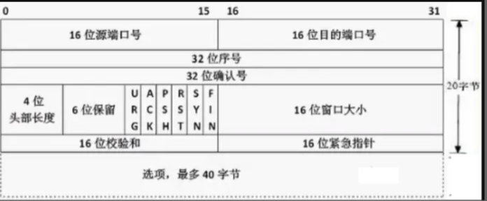
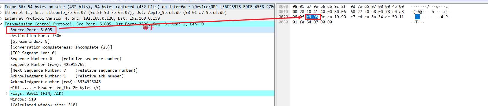
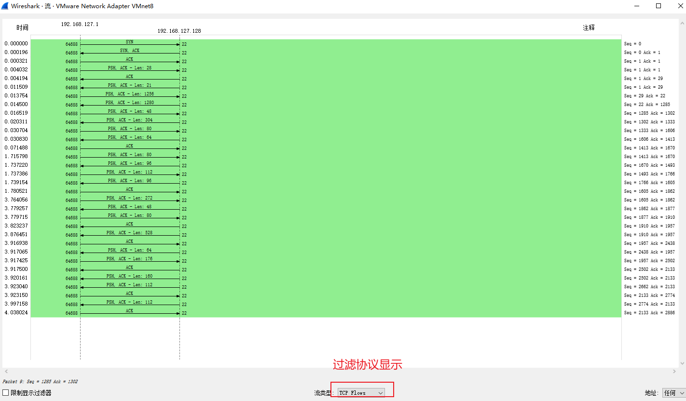

#### 1, 混合模式，普通模式

普通模式只接受发送给本机的正确的数据包。



#### 2, Wireshark命令



Source：表示发送方
Destination : 表示接受方

在搜索行输入以下命令

```txt
tcp.flags.ack==0   # ack: acknowdlege 确认请求
tcp.flags.ack==0 and tcp.flags.syn==1  : 组合多个条件查询，syn表示刚发的请求过去
and/or : 两个条件的逻辑关系
tcp.flags.fin==1 : 查询已发完的数据
udp/tcp/arp/dns :  查询指定类型协议，注意：udp协议的查询结果包括dns协议
ip.src_host==192.168.0.104 ： 查询指定发送方的请求
ip.dst_host==132.154.15.44 ： 查询指定接收放的请求
ip.src_host==192.168.0.104 or ip.dst_host==132.154.15.44 : 指定发送方或接收方
ip.addr==192.168.0.104 : 查询接收地址或者发送地址等于指定值的请求
```

#### 3, 界面说明



#### 4,  使用范例

##### 4.1, ICMP协议：

ping命令使用的就是ICMP协议。

以本地主机ping网关为例：




##### 4.2, TCP协议：

参考文章：https://zhuanlan.zhihu.com/p/108504297

**一，TCP建立链接，三次握手。**

SSH登录服务器使用的就是TCP协议，可以使用此方法，避免Wireshark请求过多不好找。

具体分析参照[TCP三次握手和四次挥手](./TCP三次握手，四次挥手.pptx)

(1)为什么建立连接要三次握手？

为了证明客户端和服务端都能接收发送数据，从而建立一个可靠的连接。

**二，TCP断开连接，四次挥手。**

断开连接可以由客户端发起，也可以由服务端发起。TCP协议是全双工的协议，因此一方关闭后，另一方需要自行关闭从而结束整个连接。

(2)为什么断开连接需要四次，而不是三次？

结合图示理解。
例如，断开连接先由客户端发起第一次挥手，说明客户端的数据已经输出完成。
服务端接收到后，有可能服务端的数据接收完成了，但是有数据还没发送完成，所以服务端先执行一次挥手(总的第二次)，表示：”我接收到断开请求了，但是我还有数据输出给你，先等等。” 
等服务端数据传输完成后，服务端再执行一次挥手(总的第三次)，告诉客户端：”我发送完了，可以断开“。
最后服务端发送第四次挥手，正式断开连接。

**三，TCP协议的报文格式和Wireshark中的对应**

TCP协议头部格式，和Wireshark解析出的数据是一一对应的



左侧是10进制数，右侧是实际传输的16进制数，单击左侧每行数据可使高亮显示对应的数据，通过计算验证可知两者是相等的，且符合TCP的头部格式。



#### 5，流量图使用

菜单：统计->流量图。使用图形展示请求



